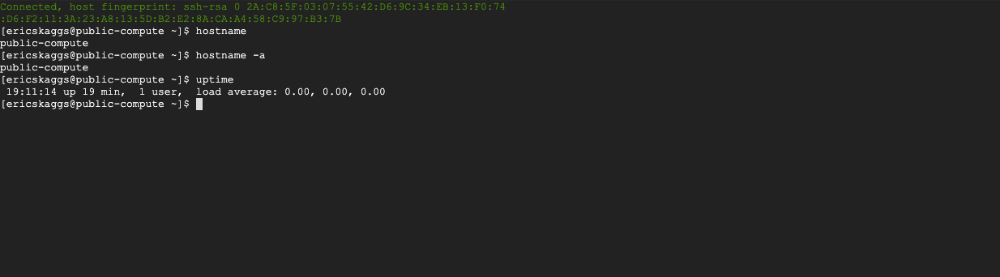

#Table of Contents

1. [Implementation](#implementation)
2. [Modules](#modules)
3. [Outputs from modules](#outputs-from-modules)
4. [Future](#future)
5. [Image of ssh'd in](#image)
6. [Sources](#sources)

## Implementation:

For this challenge my first decision was to figure out where I wanted the state file to go. Figuring that this is just for a POC and a very basic setup I decided to just do a local terraform state file instead of having it in a GCP bucket to lessen complexity and to ensure that all resources would be deleted when POC was complete. Also wanted to ensure the existence of at .gitignore file to make sure that all tfstate, credentials, and .terraform directories/files were not uploaded to Github.

While the client POC called for folders and service projects, this was not implemented as there isn't a domain to create an organization within GCP and that is needed in order to have a folder structure for projects and organizations. So this was skipped until there can be a domain acquired and an organization created.

Next I decided on what parts should become a module and what resources should be grouped in those modules. There are a lot of modules that are already created on the internet but wanted to create custom modules for this POC as to only use what is really needed and for a way to allow the customer to look at simpler modules that only did the necessity of what is being asked for. All modules are housed within this repo for ease of use during a POC.

### Modules

- The VPC module is used to create the vpc itself along with all subnetworks that are to be included into the vpc. This module also creates the nat router and gateway.
  &nbsp;
- The firewall module is as basic as it gets. This module will control what firewall rules are used for the VPC. This was separated out for future use as this can be reused for further vpc poc within GCP.
  &nbsp;
- The compute module creates any compute nodes that will be housed within the VPC. Its straight forward for now using a resource for each compute instance but long term would want to turn those into terraform loops to handle multiple instances with using only specific resources for specific compute types. This also has the code to create persistent disks to be used with each of the compute instances created, again long term would turn into loops for creation and attachment to compute instances.
  &nbsp;
- The load-balancer module create all the components that is needed to create a load-balancer that will pass back http traffic to a backend service group that is on a private ip space.

### Outputs from Modules

VPC and compute were the only modules that have outputs created for them. This was to keep with the simplistic design of the overall POC and to allow the use of terraform created items to be used as variables within other modules. Future road map would be to create outputs for each module and within each modules every infrastructure piece that is created by terraform would also have an associated output value.

### Future

Here's a list of what should be done for moving forward with this to make it more robust and have the ability to become more flexible.

- Move all modules into their own repos. This will allow each module to be developed independently and have the ability to be locked at specific version to be upgraded when the project/application is needing the additional features.

- Create the additional output values for each modules as stated before.

- Create an organization and CI/Cd project to be able to create everything through automation for all projects, folders, service accounts that are going to be used by company.

- Create a CI/CD process for deploying all terraform code through a pipeline and through the use of automated workflows.

### Image

### Sources

Multiple sources were used as well as previous written code.
Including:

- Terraform.io - docs
- medium.com
- stackoverflow.com
- cloud.google.com - docs
